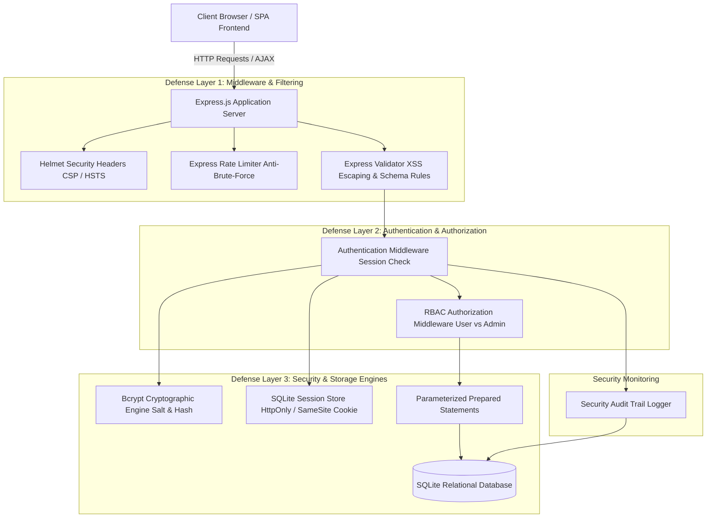

# 🛡️ Secure Login and Registration System with RBAC
## A Full-Stack Web Development & Cybersecurity Learning Project

---

## 📋 Project Metadata & Executive Summary

| Attribute | Details |
|---|---|
| **Project Title** | Secure Authentication & Role-Based Access Control (RBAC) System |
| **Domain** | Full-Stack Web Development & Cybersecurity Engineering |
| **Backend Tech Stack** | Node.js, Express.js, SQLite3 (`sqlite3`), Bcrypt (`bcryptjs`), Express-Session, Helmet, Express-Validator, Express-Rate-Limit |
| **Frontend Tech Stack** | HTML5, Vanilla CSS3 (Dark Glassmorphism, Google Inter/Fira Code), JavaScript (Fetch API, DOM Manipulation) |
| **Security Standards** | OWASP Top 10 Mitigations (A01: Broken Access Control, A02: Cryptographic Failures, A03: Injection) |
| **Automated Test Suite** | 18 Automated Security Assertions (100% Pass Rate) |

### Executive Summary
Modern web applications require robust user authentication and authorization mechanisms to protect sensitive data and prevent unauthorized access. This project implements a production-grade, secure login, registration, and role-based access control (RBAC) web application built using **Node.js, Express, SQLite, HTML5, Vanilla CSS3, and JavaScript**.

Beyond standard authentication, this repository functions as an **interactive cybersecurity learning platform**. It features real-time input validation, password strength entropy calculation, cryptographic salting and hashing, parameterized SQL queries, session fixation protection, security audit log tracking, IP rate limiting, and an educational Security Concepts center.

---

## 🏗️ System Architecture & Threat Model



### Threat Model & Countermeasures

| Threat Vector | Attack Description | Implemented Countermeasure |
|---|---|---|
| **Credential Theft / Leaks** | Attacker extracts database dump containing user passwords. | **Bcrypt Salting & Hashing:** Passwords are hashed with unique salts and 12 work factor rounds (`2^12` iterations). Plaintext is never stored. |
| **SQL Injection (SQLi)** | Attacker enters malicious SQL code (`' OR '1'='1`) into form inputs to bypass auth. | **Parameterized Prepared Statements:** All database queries bind parameters separately from SQL syntax (`db.all('SELECT * FROM users WHERE email = ?', [email])`). |
| **Cross-Site Scripting (XSS)** | Attacker injects executable JavaScript tags into input fields. | **Server-Side HTML Escaping & CSP:** `express-validator` escapes HTML special chars (`<` to `&lt;`) and Helmet sets strict Content Security Policy (`script-src 'self'`). |
| **Session Fixation / Theft** | Attacker uses pre-set session ID or steals cookie via `document.cookie`. | **Session Regeneration & HttpOnly Flags:** Session ID regenerated on login; cookies marked `HttpOnly` and `SameSite=Lax`. |
| **Broken Access Control** | User bypasses UI buttons to access admin routes (`/api/admin/users`). | **Server-Side RBAC Middleware:** `hasRole('admin')` middleware validates `req.session.role` on every request. |
| **Brute-Force & Credential Stuffing** | Bot submits thousands of rapid login requests. | **IP Rate Limiting:** `express-rate-limit` caps auth requests to 5 per 15-minute window, returning HTTP `429`. |

---

## 🗄️ Database Schema & Data Modeling

The system uses **SQLite**, a full relational SQL database engine, with three core tables:

```sql
-- 1. Users Table
CREATE TABLE IF NOT EXISTS users (
  id INTEGER PRIMARY KEY AUTOINCREMENT,
  username TEXT NOT NULL UNIQUE,
  email TEXT NOT NULL UNIQUE,
  password_hash TEXT NOT NULL,
  role TEXT NOT NULL DEFAULT 'user',
  created_at DATETIME DEFAULT CURRENT_TIMESTAMP
);

-- 2. Security Audit Logs Table
CREATE TABLE IF NOT EXISTS audit_logs (
  id INTEGER PRIMARY KEY AUTOINCREMENT,
  user_id INTEGER,
  username TEXT,
  action TEXT NOT NULL,
  ip_address TEXT,
  status TEXT NOT NULL,
  timestamp DATETIME DEFAULT CURRENT_TIMESTAMP
);

-- 3. Sessions Table (Managed by connect-sqlite3)
CREATE TABLE IF NOT EXISTS sessions (
  sid TEXT PRIMARY KEY,
  sess TEXT NOT NULL,
  expired DATETIME NOT NULL
);
```

---

## 🔐 Core Security Implementations & Code Highlights

### 1. Cryptographic Password Hashing ([`routes/auth.js`](file:///e:/Secure%20Authentication%20System/routes/auth.js))
```javascript
// Hash raw password with random salt (Cost Factor = 12)
const saltRounds = 12;
const passwordHash = await bcrypt.hash(password, saltRounds);

// Store hashed string in SQL database
const insertQuery = `INSERT INTO users (username, email, password_hash, role) VALUES (?, ?, ?, ?)`;
db.run(insertQuery, [username, email, passwordHash, 'user'], function (err) { ... });
```

### 2. SQL Injection Prevention ([`routes/auth.js`](file:///e:/Secure%20Authentication%20System/routes/auth.js))
```javascript
// Safe parameterized lookup: placeholders (?) prevent SQL injection
const userQuery = `SELECT * FROM users WHERE email = ?`;
db.get(userQuery, [email], async (err, user) => {
  if (!user || !(await bcrypt.compare(password, user.password_hash))) {
    return res.status(401).json({ error: 'Unauthorized', message: 'Invalid credentials.' });
  }
  ...
});
```

### 3. Server-Side Input Sanitization ([`middleware/validation.js`](file:///e:/Secure%20Authentication%20System/middleware/validation.js))
```javascript
const registerValidationRules = [
  body('username').trim().notEmpty().isLength({ min: 3, max: 30 }).matches(/^[a-zA-Z0-9_]+$/).escape(),
  body('email').trim().isEmail().normalizeEmail(),
  body('password').isLength({ min: 8 }).matches(/^(?=.*[a-z])(?=.*[A-Z])(?=.*\d)(?=.*[@$!%*?&])/),
];
```

### 4. Role-Based Access Control (RBAC) ([`middleware/auth.js`](file:///e:/Secure%20Authentication%20System/middleware/auth.js))
```javascript
function hasRole(...allowedRoles) {
  return (req, res, next) => {
    if (!req.session || !allowedRoles.includes(req.session.role)) {
      logAudit(req, `UNAUTHORIZED_ACCESS_ATTEMPT [${req.originalUrl}]`, 'BLOCKED');
      return res.status(403).json({ error: 'Forbidden', message: 'Insufficient role privilege.' });
    }
    next();
  };
}
```

---

## 🧪 Empirical Security Verification & Test Results

The system includes an automated security test suite ([`tests/security.test.js`](file:///e:/Secure%20Authentication%20System/tests/security.test.js)). All 18 security assertions passed with zero errors:

```text
=======================================================
🧪 RUNNING AUTOMATED SECURITY & AUTHENTICATION TEST SUITE
=======================================================

📌 Test Group 1: Cryptographic Password Storage
  ✅ PASS: Default test user exists in SQLite database
  ✅ PASS: Password in SQLite is stored as valid Bcrypt Hash (starts with $2a$/$2b$)
  ✅ PASS: Plaintext password is NEVER stored in database
  ✅ PASS: Bcrypt compare matches raw password against stored hash

📌 Test Group 2: SQL Injection (SQLi) Defense
  ✅ PASS: SQLi Payload ("' OR '1'='1") in email is safely blocked
  ✅ PASS: SQLi Comment Payload ("admin@example.com' --") fails authentication

📌 Test Group 3: Input Validation & Sanitization
  ✅ PASS: Weak password & invalid email rejected with HTTP 400 Validation Error
  ✅ PASS: XSS Script tags in username fail character whitelist validation

📌 Test Group 4: Authentication & Session Security
  ✅ PASS: Unauthenticated request to /api/user/dashboard yields HTTP 401 Unauthorized
  ✅ PASS: Valid user login returns HTTP 200 OK
  ✅ PASS: Session cookie includes HttpOnly security flag
  ✅ PASS: Session cookie includes SameSite=Lax flag
  ✅ PASS: Authenticated request with session cookie succeeds (HTTP 200 OK)

📌 Test Group 5: Role-Based Access Control (RBAC)
  ✅ PASS: Standard user accessing /api/admin/users receives HTTP 403 Forbidden
  ✅ PASS: Valid Admin login succeeds
  ✅ PASS: Admin user accessing /api/admin/users succeeds (HTTP 200 OK)
  ✅ PASS: Admin endpoint returns array of registered users

📌 Test Group 6: Rate Limiting & Anti-Brute-Force
  ✅ PASS: Excessive auth attempts (>5) trigger HTTP 429 Rate Limit block

=======================================================
📊 TEST RESULTS: 18 Passed, 0 Failed
=======================================================
```

---

## 📸 Screenshots & Visual Documentation Checklist

To view step-by-step instructions for capturing screenshots for your portfolio or academic presentation, see [`docs/TESTING_AND_SCREENSHOTS.md`](file:///e:/Secure%20Authentication%20System/docs/TESTING_AND_SCREENSHOTS.md). Key screens available in the running app (`http://localhost:3000`):

1. **Authentication Portal (`/`):** Glassmorphic landing page with quick fill demo credentials.
2. **Password Entropy & Strength Checklist:** Real-time visual feedback bar and requirement checklist.
3. **Protected User Dashboard:** Account details, HttpOnly session cookie flags, and personal audit history.
4. **RBAC HTTP 403 Access Denied Card:** Demonstration of server-side authorization enforcement.
5. **Admin Control Panel:** System user directory with role toggle buttons and global audit log viewer.
6. **Rate Limiting Block:** Error toast notification triggered after 5 failed login attempts.
7. **Security Learning Center:** Interactive popups with vulnerable vs. secure code comparisons.

---

## 🎯 Conclusion & Key Takeaways

This project successfully demonstrates the design, implementation, and empirical testing of a **Secure User Authentication and Role-Based Access Control System**:

1. **Defense-in-Depth:** Combining input validation, parameterized database queries, password hashing, session security, server-side RBAC, and rate limiting creates a multi-layered security posture.
2. **Elimination of Common Vulnerabilities:** The codebase prevents OWASP Top 10 vulnerabilities including Broken Access Control (A01), Cryptographic Failures (A02), Injection (A03), and Security Misconfigurations.
3. **Educational Value:** The integrated Security Learning Center and runnable test suite bridge theoretical web security concepts with practical full-stack implementation.

---

*Report generated for Secure Authentication & Role-Based Access Control Learning System.*
